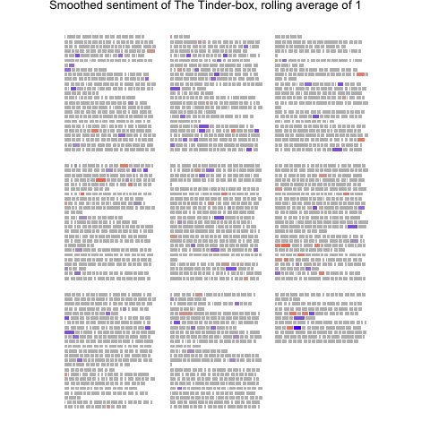

```{r, include = FALSE}
knitr::opts_chunk$set(echo = TRUE, collapse = TRUE, message = FALSE, 
                      warning = FALSE, error = FALSE, fig.retina = 2,
                      fig.path = "man/figures/README-")
```

# ggpage

[](https://travis-ci.org/EmilHvitfeldt/ggpage)

`ggpage` is a package to create pagestyled visualizations of text based data. It uses ggplot2 and final returns are ggplot2 objects.

## Installation

You can install ggpage from github with:

```{r gh-installation, eval = FALSE}
# install.packages("devtools")
devtools::install_github("EmilHvitfeldt/ggpage")
```

## Example

The package includes The Tinder-box by H.C. Andersen for examples.

```{r}
library(ggpage)

head(tinderbox, 10)
```

The basic workflow with ggpage is using either 

- `ggpage_quick` for a quick one function call plot or,
- combining `ggpage_build` and `ggpage_plot` to do analysis (NLP for example) before the final plot is produced.

For a simple demontration we apply `ggpage_quick` to our `tinderbox` object.

```{r}
ggpage_quick(tinderbox)

# Also pipeable
# tinderbox %>% ggpage_quick()
```

The same result would be achived by using 

```{r eval=FALSE}
tinderbox %>% 
  ggpage_build() %>% 
  ggpage_plot()
```

But this approach allows us to introduce more code between `ggpage_build` and `ggpage_plot` giving us multiple more ways to enhance the plots

```{r}
tinderbox %>%
  ggpage_build() %>%
  mutate(long_word = stringr::str_length(word) > 8) %>%
  ggpage_plot(aes(fill = long_word)) +
  labs(title = "Longer words throughout The Tinder-box") +
  scale_fill_manual(values = c("grey70", "blue"),
                    labels = c("8 or less", "9 or more"),
                    name = "Word length")
```

And it will nicely with other tidyverse packages

```{r eval=FALSE}
library(ggpage)
library(purrr)
library(gganimate)

prebuild <- tinderbox %>%
  ggpage_build() %>%
  left_join(get_sentiments("afinn"), by = "word") 

midbuild <- map_df(.x = 0:50 * 10 + 1,
                   ~ prebuild %>% 
                    mutate(score = ifelse(is.na(score), 0, score), 
                           score_smooth = zoo::rollmean(score, .x, 0),
                           score_smooth = score_smooth / max(score_smooth),
                           rolls = .x))

p <- midbuild %>%
  ggpage_plot(aes(fill = score_smooth, frame = rolls)) +
  scale_fill_gradient2(low = "red", high = "blue", mid = "grey", midpoint = 0) +
  guides(fill = "none") +
  labs(title = "Smoothed sentiment of The Tinder-box, rolling average of")

gganimate(p, interval = .2)
```

