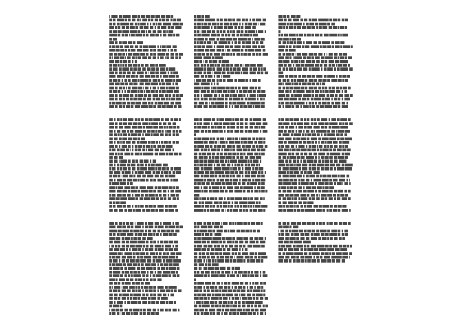
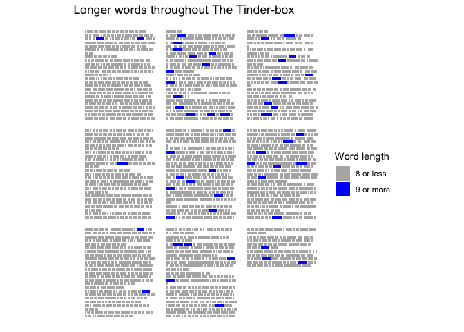

# ggpage

[](https://travis-ci.org/EmilHvitfeldt/ggpage)
[](https://ci.appveyor.com/project/EmilHvitfeldt/ggpage)
[](https://codecov.io/github/EmilHvitfeldt/ggpage?branch=master)
[](https://cran.r-project.org/package=ggpage)

`ggpage` is a package to create pagestyled visualizations of text based
data. It uses ggplot2 and final returns are ggplot2 objects.

## Version 0.2.0

In this new version I have worked to include a lot of use cases that
wasn’t available in the first version. These new elements are previewed
in the vignette.

## Installation

You can install the released version of ggpage from
[CRAN](https://cran.r-project.org/) with:

``` r
install.packages("paletteer")
```

or you can install the developmental version of ggpage from github with:

``` r
# install.packages("devtools")
devtools::install_github("EmilHvitfeldt/ggpage")
```

## Example

The package includes The Tinder-box by H.C. Andersen for examples.

``` r
library(tidyverse)
library(ggpage)

head(tinderbox, 10)
## # A tibble: 10 x 2
##    text                                                       book        
##    <chr>                                                      <chr>       
##  1 "A soldier came marching along the high road: \"Left, rig… The tinder-…
##  2 had his knapsack on his back, and a sword at his side; he… The tinder-…
##  3 and was now returning home. As he walked on, he met a ver… The tinder-…
##  4 witch in the road. Her under-lip hung quite down on her b… The tinder-…
##  5 "and said, \"Good evening, soldier; you have a very fine … The tinder-…
##  6 knapsack, and you are a real soldier; so you shall have a… The tinder-…
##  7 "you like.\""                                              The tinder-…
##  8 "\"Thank you, old witch,\" said the soldier."              The tinder-…
##  9 "\"Do you see that large tree,\" said the witch, pointing… The tinder-…
## 10 "beside them. \"Well, it is quite hollow inside, and you … The tinder-…
```

The basic workflow with ggpage is using either

  - `ggpage_quick` for a quick one function call plot or,
  - combining `ggpage_build` and `ggpage_plot` to do analysis (NLP for
    example) before the final plot is produced.

For a simple demonstration we apply `ggpage_quick` to our `tinderbox`
object. It is important that the data.frame that is used have the text
in a column named “text”.

``` r
ggpage_quick(tinderbox)
```



``` r

# Also pipeable
# tinderbox %>% ggpage_quick()
```

The same result would be achieved by using

``` r
tinderbox %>% 
  ggpage_build() %>% 
  ggpage_plot()
```

But this approach allows us to introduce more code between
`ggpage_build` and `ggpage_plot` giving us multiple more ways to enhance
the plots

``` r
tinderbox %>%
  ggpage_build() %>%
  mutate(long_word = stringr::str_length(word) > 8) %>%
  ggpage_plot(aes(fill = long_word)) +
  labs(title = "Longer words throughout The Tinder-box") +
  scale_fill_manual(values = c("grey70", "blue"),
                    labels = c("8 or less", "9 or more"),
                    name = "Word length")
```



And it will work nicely with other tidyverse packages

``` r
library(ggpage)
library(purrr)
library(gganimate)
library(tidytext)
library(zoo)

prebuild <- tinderbox %>%
  ggpage_build() %>%
  left_join(get_sentiments("afinn"), by = "word") 

midbuild <- map_df(.x = 0:50 * 10 + 1,
                   ~ prebuild %>% 
                    mutate(score = ifelse(is.na(score), 0, score), 
                           score_smooth = zoo::rollmean(score, .x, 0),
                           score_smooth = score_smooth / max(score_smooth),
                           rolls = .x))

midbuild %>%
  ggpage_plot(aes(fill = score_smooth)) +
  scale_fill_gradient2(low = "red", high = "blue", mid = "grey", midpoint = 0) +
  guides(fill = "none") +
  labs(title = "Smoothed sentiment of The Tinder-box, rolling average of {round(frame_time)}") +
  transition_time(rolls)
```
