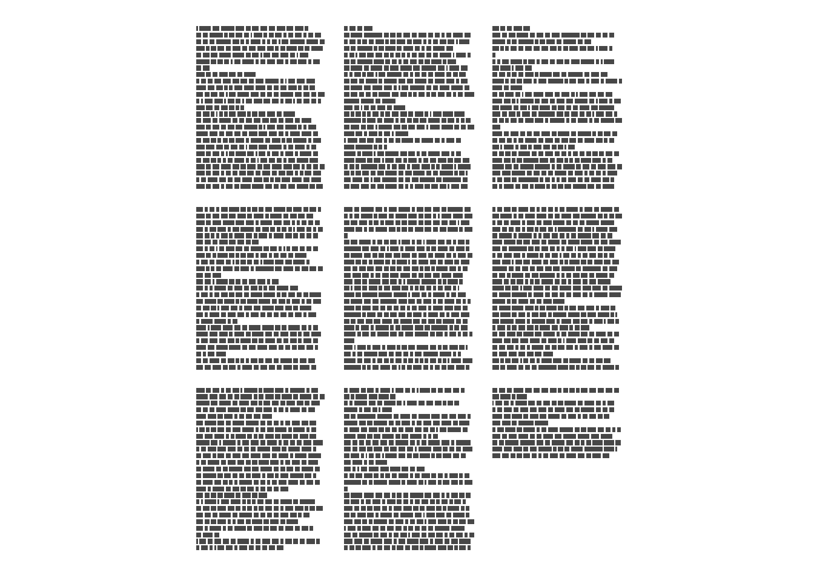
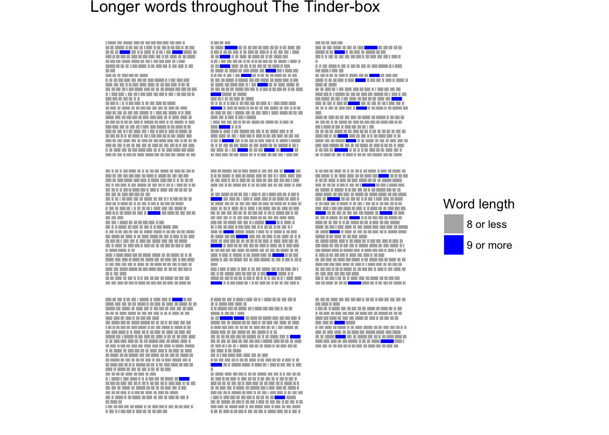

ggpage
======

`ggpage` is a package to create pagestyled visualizations of text based data. It uses ggplot2 and final returns are ggplot2 objects.

Installation
------------

You can install ggpage from github with:

``` r
# install.packages("devtools")
devtools::install_github("EmilHvitfeldt/ggpage")
```

Example
-------

The package includes The Tinder-box by H.C. Andersen for examples.

``` r
library(ggpage)

head(tinderbox, 10)
## # A tibble: 10 x 2
##                                                                           text
##                                                                          <chr>
##  1 "A soldier came marching along the high road: \"Left, right - left, right.\
##  2 had his knapsack on his back, and a sword at his side; he had been to the w
##  3 and was now returning home. As he walked on, he met a very frightful-lookin
##  4 witch in the road. Her under-lip hung quite down on her breast, and she sto
##  5 "and said, \"Good evening, soldier; you have a very fine sword, and a large
##  6 knapsack, and you are a real soldier; so you shall have as much money as ev
##  7                                                               "you like.\""
##  8                               "\"Thank you, old witch,\" said the soldier."
##  9 "\"Do you see that large tree,\" said the witch, pointing to a tree which s
## 10 "beside them. \"Well, it is quite hollow inside, and you must climb to the 
## # ... with 1 more variables: book <chr>
```

The basic workflow with ggpage is using either

-   `ggpage_quick` for a quick one function call plot or,
-   combining `ggpage_build` and `ggpage_plot` to do analysis (NLP for example) before the final plot is produced.

For a simple demontration we apply `ggpage_quick` to our `tinderbox` object.

``` r
ggpage_quick(tinderbox)
```



``` r

# Also pipeable
# tinderbox %>% ggpage_quick()
```

The same result would be achived by using

``` r
tinderbox %>% 
  ggpage_build() %>% 
  ggpage_plot()
```

But this approach allows us to introduce more code between `ggpage_build` and `ggpage_plot` giving us multiple more ways to enhance the plots

``` r
tinderbox %>%
  ggpage_build() %>%
  mutate(long_word = stringr::str_length(word) > 8) %>%
  ggpage_plot(aes(fill = long_word)) +
  labs(title = "Longer words throughout The Tinder-box") +
  scale_fill_manual(values = c("grey70", "blue"),
                    labels = c("8 or less", "9 or more"),
                    name = "Word length")
```



And it will nicely with other tidyverse packages

``` r
library(ggpage)
library(purrr)
library(gganimate)

prebuild <- tinderbox %>%
  ggpage_build() %>%
  left_join(get_sentiments("afinn"), by = "word") 

midbuild <- map_df(.x = 0:50 * 10 + 1,
                   ~ prebuild %>% 
                    mutate(score = ifelse(is.na(score), 0, score), 
                           score_smooth = zoo::rollmean(score, .x, 0),
                           score_smooth = score_smooth / max(score_smooth),
                           rolls = .x))

p <- midbuild %>%
  ggpage_plot(aes(fill = score_smooth, frame = rolls)) +
  scale_fill_gradient2(low = "red", high = "blue", mid = "grey", midpoint = 0) +
  guides(fill = "none") +
  labs(title = "Smoothed sentiment of The Tinder-box, rolling average of")

gganimate(p, interval = .2)
```


